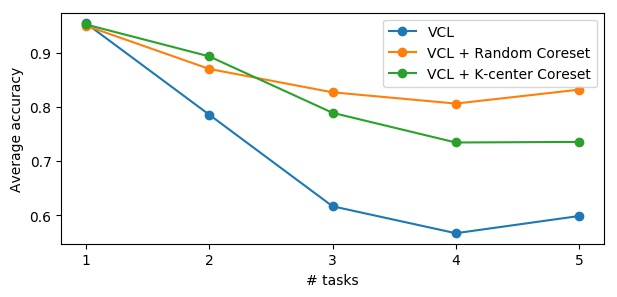
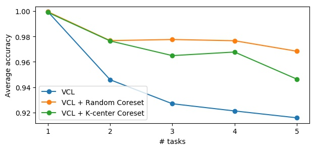

# Continual Learning for Deep Discriminative Models

Requirement: Tensorflow 1.4.0.

**To run the Permuted MNIST experiment:**

	python run_permuted.py

**To run the Split MNIST experiment:**

	python run_split.py

The printed results are matrices where each row i contains the test set accuracies on all previously observed tasks after seeing task i. The average accuracy will also be plotted and saved to [results/](results/). They should be similar to the following figures:

**Permuted MNIST**

**Split MNIST**

